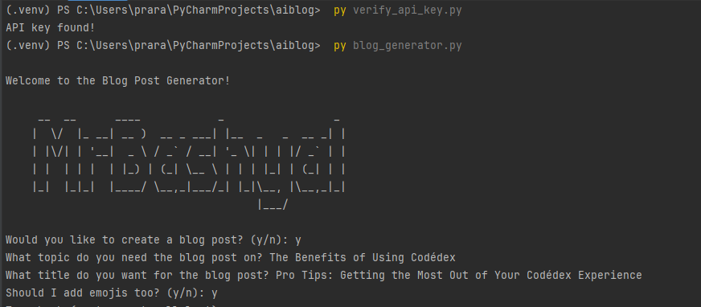

# Blog Post Generator

This project is a Python-based application that generates blog posts using OpenAI's GPT-4o model. The application prompts the user for a topic and title, and optionally includes emojis in the generated blog post.

## Features

- Generates blog posts based on user-provided prompts.
- Option to include emojis in the blog post.
- Uses OpenAI's GPT-4o model for text generation.

## Requirements

- Python 3.x
- `python-dotenv` library
- `openai` library

## Installation

1. Clone the repository:
    ```sh
    git clone https://github.com/Prarambha369/aiblog.git
    cd blog-post-generator
    ```

2. Install the required libraries:
    ```sh
    pip install -r requirements.txt
    ```

3. Create a `.env` file in the root directory and add your OpenAI API key:
    ```dotenv
    OPENAI_API_KEY="your-api-key"
    ```

## Usage

1. Run the `verify_api_key.py` script to ensure your API key is set up correctly:
    ```sh
    python verify_api_key.py
    ```

2. Run the `blog_generator.py` script to generate a blog post:
    ```sh
    python blog_generator.py
    ```

3. Follow the prompts to create your blog post.

# Preview 
